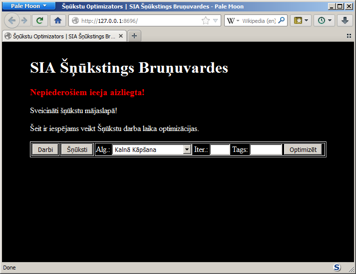
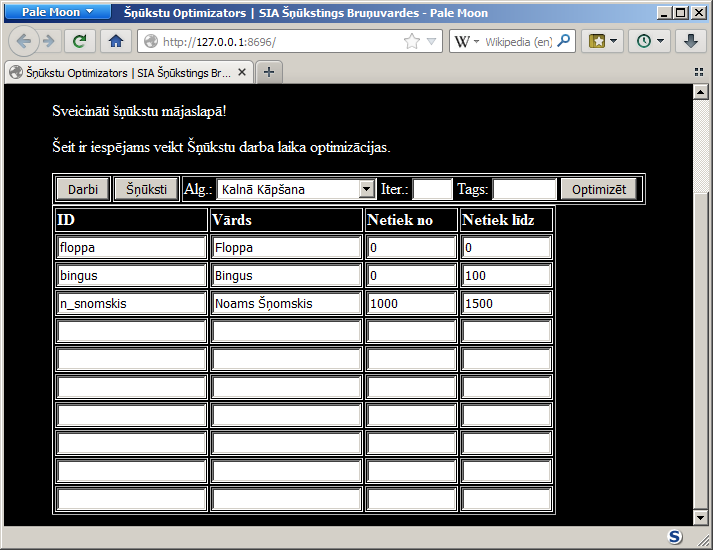

# SIA Šņūkstings Bruņuvardes lielo darbu optimizators

# Palaišana

Vispirms vajag tikt pie Erlang instalācijas. Pēc tam vajag ielādēt repozitoriju,
aiznavigēties uz to un tajā palaista komandrindu. Tad ar `erl` komandu var
palaist erlang interpretatoru. Tad vajag nokompilēt programmu:
```c(domain).
c(optimizer).
c(server).```
Pēc tam vajag palaist optimizēšanas serveri un HTTP serveri:
```optimizer:start_manager().
server:start().```
Ja serveri met ārā kaut kādus kļūdu paziņojumus, tad dažkārt var vēl pāris reizes
mēģināt tos iestartēt un varbūt tad sanāks.
Tad kad komandrindā parādās paziņojums `Waiting for a connection...`, tad var vērt
vaļā pārlūkprogrammu un `http://127.0.0.1:8696` būs atrodams šņūkstu optimizators.

# Programmas instrukcija
## Darbplūsma
1. Nokonfigurēt šņūkstu sarakstu.
2. Iestatīt optimizatora iestatījumus.
3. Nosūtīt optimizācijas uzdevumu serveri.
4. Sagaidīt optimizācijas uzdevuma beigšanos.
5. Apskatīt optimizācijas rezultātu.
6. Novērtēt rezultātu.
7. Nepieciešamības gadījumā atgriezties punktā 2.

## Saskarne
Galvenie saskarnes elementi -- virsraksts, sarkanais brīdinājums, darba josla,
datu tabula (nav parādīta).


## Šņūkstu konfigurācija
Nospiest uz darbjoslas pogas "Šņūksti". Aizpildīt tabulu. Pēc katra ieraksta 
veikšanas, tabulas saturs tiks automātiski saglabāts pārlūkprogrammas kešatmiņā.

Programma neveic nekādu ievada validāciju. Lūdzu ievadīt tikai pareizu ievadu.
Gadījumā ja serveris pēc nepareiza ievada veic atteici, ievadīt servera
konsolē komandas `optimizer:start_manager().` un `server:start().` līdz
serveris beidz mest kļūdas.

**ID** laukā ir jāievada šņūksta identifikators, kas var būt jebkura
alfabētiska simoblu virkne, bez atstarpēm, t.i. simbolu virkne kas sastāv no
saprātīga daudzuma simbolu, kas redzami šajā sarakstā:
`qwertyuiopasdfghjklzxcvbnm`.

**Vārds** laukā ir jāvieda šņūksta vārds. Atļauti jebkādi alfanumeriski
simboli, izņemot iekavas dubultpēdiņas `"`, kas tāpat nav alfanumerisks simbols,
bet tas ir īpaši aizliegts.

**Netiek no** laukā ir jāievada laika moments, no kura šņūksts nebūs pieejams.
**Netiek uz** laukā ir jāievada laika moments, no kura šņūksts būs atkal pieejams.
Laika moments ir vesels skaitlis intevālā no `0` līdz `4000`. Darba dienas sākums ir
`0`, pusdienas iešņūkstēšanās notiek `1000`, normālās darba dienas beigas ir `2000`, 
virsstrāde atļauta līdz `4000`. Gadījumā ja šņūksts būs pieejams visu dienu, tad
abos laukumos ir jāieraksta `0`.



